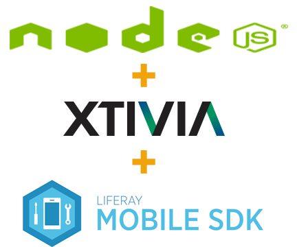

# liferay-client-nodejs


This is an implementation by [XTIVIA](http://www.xtivia.com) of the [Liferay Mobile SDK](https://github.com/liferay/liferay-mobile-sdk) for any nodejs based application.

##Usage
To use this package as part of a front-end application simply add a bower dependency for liferay-mobile-sdk-angularjs.

```
    npm install --save liferay-client-nodejs
```

### Signin to remote host
Currently this package supports basic authentication. The following is an example of how to do this in an mocha test.

```          
    'use strict';
    var chai = require('chai');
    /*global describe: true, it: true, before: false, after: false*/
    
    var userEmail = process.env.MOCHA_TEST_USER;
    var password = process.env.MOCHA_TEST_CREDENTIALS;
    
    describe('Test build of services using Xtivia\'s Liferay Demo server',function() {
        describe('Test signin functionality',function() {
            it('should pass if server is available and user information is correct',function() {
                this.timeout(15000); // Just in case slow access to server
                return require('../../index.js')({server:'http://liferaydemo.xtivia.com',contexts:{'mobile-demo-integration-portlet':'MobileDemo'}}).then(function(connection){
                    chai.assert.isNotNull(connection);
                    return connection.signin({
                        authenticationType: connection.AuthenticationType.BASIC,
                        username: userEmail,
                        credentials: password
                    }).then(function(ctx) {
                        chai.assert.isNotNull(ctx);
                        console.log(ctx);
                    },function(err) {
                        throw err;
                    });
                },function(err) {
                    throw err;
                });
            });
        });
    });
```
 